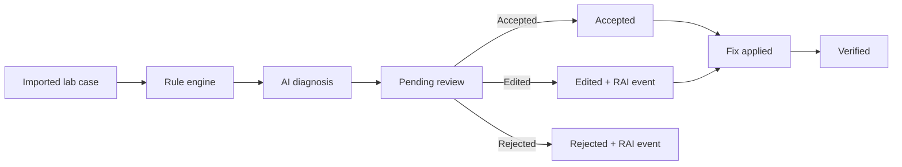

# NetSage AI

**Symptom + topology + show-command evidence → deterministic rules → structured AI diagnosis → a human must accept, edit, or reject → optional fix attestation.**

NetSage AI is a Cisco Packet Tracer lab troubleshooter for the NetAcad VIP 2026 AI track. It helps a student or reviewer walk a real lab fault the way an analyst would: inspect evidence, run checks that do not invent facts, ask a model for a structured answer, then decide whether that answer is good enough to act on.

It does **not** drive Packet Tracer. It does **not** invent a diagnosis when the LLM is down. It does **not** hardcode dashboard numbers. Analytics are counted from SQLite.

| | |
|---|---|
| **Demo case** | [VLAN-001](http://127.0.0.1:5174/cases/VLAN-001) — missing VLAN 30, inactive access port |
| **API** | `http://127.0.0.1:8000/api/v1` |
| **UI** | `http://127.0.0.1:5173` (Vite may fall back to `5174`) |
| **Catalog** | 36 authored Packet Tracer-style cases · 8 fault types · coverage gate ≥ 30 |

---

## Why this exists

Packet Tracer labs fail for ordinary reasons: a VLAN is missing, a gateway is wrong, an ACL is on the wrong interface. Students usually jump straight to “ask the AI.” That is unsafe. Models paraphrase evidence, pick the wrong OSI layer, or sound confident while the show output says something else.

NetSage AI splits the job:

1. **Evidence first.** Every case ships with a symptom, topology note, and real `show` output.
2. **Rules before the model.** Deterministic checks run on the dump. Their findings are fed to the LLM and stored for audit.
3. **Structured diagnosis.** The model must return JSON: root cause, confidence, OSI layer, concept, severity, quoted evidence, next command, fix steps, verification command.
4. **Human gate.** Nothing is accepted until a reviewer records **Accepted**, **Edited**, or **Rejected**. Edits and rejects write a Responsible AI record. The original `raw_response` is never overwritten.
5. **Human verification.** Marking a fix applied, then verified, is a person attesting they did the Packet Tracer change. The app does not click Cisco commands for you.

---

## How a case moves



Rejected diagnoses cannot be marked applied or verified. A verified case keeps its official diagnosis on screen even if someone later requests another AI run. Re-diagnosis on a verified case is a secondary action and asks for confirmation first. Historical reviews and `raw_response` stay untouched.

---

## Five-minute demo

Use this path for a reviewer who has never seen the repo.

1. Start the API and UI (commands below). Open **Command Center**. Confirm the catalog is 36 and the LLM is configured.
2. Open **VLAN-001** (Command Center → “Demo case VLAN-001”, or `/cases/VLAN-001`, or `/troubleshoot?case=VLAN-001`).
3. Read the **symptom**, **topology**, and **show-command evidence**. You should see `Access Mode VLAN: 30 (Inactive)`.
4. Click **Run rule engine**. Expect `MISSING_VLAN` to fail. The other built-in checks should pass.
5. Click **Diagnose with AI**. Wait for a structured card. Status is `pending_review` until a human acts.
6. Submit a review: **Accepted** if the answer is usable, **Edited** if it is close but wrong on layer / concept / evidence, **Rejected** only if the whole answer is unusable.
7. If accepted or edited: **Mark fix applied**, then **Record verification** after you actually repair the lab in Packet Tracer (for VLAN-001, create VLAN 30 and ping `192.168.30.10`).
8. Open **Analytics** and **Responsible AI**. Every figure on those pages is a database count.

If the LLM key is missing, diagnosis returns **503** and nothing fake is stored. That is intentional.

---

## What you will see in the UI

| Route | Page | What it is for |
|---|---|---|
| `/` | Command Center | Live catalog, review queue, coverage, KPI strip from the API |
| `/troubleshoot` | Troubleshooting | Workbench: load a case, inspect evidence, run rules or AI |
| `/cases` | Cases | Full catalog, filters, seed, create |
| `/cases/:code` | Case file | Symptom, topology, show output, rules, diagnosis, review, apply-fix, verify |
| `/diagnosis` | Diagnosis | Request a model answer; pending items link to review |
| `/review` | Human Review | Queue of `pending_review` diagnoses |
| `/review/:code` | Review workspace | Accept / edit / reject, then apply-fix and verify |
| `/rules` | Rule Engine | Run checks on a case or a pasted show dump |
| `/analytics` | Analytics | Counts and rates from SQLite |
| `/rai` | Responsible AI | Accepted / edited / rejected KPIs plus edit-and-reject correction rows |

Unknown URLs redirect to Command Center.

---

## Dataset

The catalog is **authored in Python**, not generated by an LLM and not a pile of JSON files. It seeds into SQLite on startup when `AUTO_SEED=true`.

| Concept | Cases | Typical fault |
|---|---|---|
| VLAN | 5 | Missing VLAN, native mismatch, trunk prune |
| Gateway | 4 | Wrong default gateway / SVI |
| DHCP | 4 | Pool on the wrong subnet, missing helper |
| DNS | 4 | Bad A record, unreachable resolver |
| Routing | 5 | Missing static, RIP version clash |
| ACL | 5 | Wrong direction, implicit deny, L4 filter |
| NAT | 5 | Missing inside/outside, pool / overload |
| Wireless | 4 | SSID bound to the wrong VLAN |

Coverage gate: **≥ 30 cases** and **all eight concepts**. `GET /api/v1/cases/coverage` reports whether the gate is met.

Each case has: `case_code`, title, symptom, topology note, show-command dump, expected fault, OSI layer, concept tag, severity.

`expected_fault` is **never sent to the model**. It exists so a reviewer can score the AI after the fact.

---

## Rule engine

The parser is Packet Tracer-style regex, not a full IOS compiler. It is honest about what it can see.

| Rule | What it catches |
|---|---|
| `DUP_IP` | Same IPv4 on two hosts or interfaces |
| `BAD_MASK` | Impossible or mismatched mask |
| `GW_MISMATCH` | Host gateway that is not on its subnet |
| `IF_DOWN` | Interface administratively down or protocol down |
| `MISSING_VLAN` | Access VLAN inactive / absent from `show vlan brief` |
| `MISSING_ROUTE` | Destination with no matching route |

ACL, NAT, OSPF/RIP detail, and wireless WLAN bindings are often **invisible** to these rules. That is why the model still sees the raw show output, and why a human still has to review the answer.

Rules run **before** the LLM (phase `pre_ai`) and are stored again after persist (`post_ai`) for the audit trail.

---

## AI diagnosis

The model is called only from the **backend**. The frontend never sees `LLM_API_KEY`.

Required JSON fields:

- `root_cause`
- `confidence` (0–1) and `confidence_label`
- `osi_layer`
- `concept_tag` (`concept` is accepted as an alias)
- `severity`
- `evidence[]` — each item has `quote`, `command`, `why`. Quotes are substring-checked against show output
- `next_command` / `next_commands`
- `fix_steps`
- `verification_command`

Prompts live in [`prompts/diagnose_prompt.md`](prompts/diagnose_prompt.md) and [`prompts/schema.md`](prompts/schema.md). The prompt file is hashed and stored as a `prompt_version` so you can see which instruction produced a diagnosis.

**Fail closed**

| Situation | API result | What is stored |
|---|---|---|
| No `LLM_API_KEY` | `503 llm_unavailable` | Nothing |
| Provider timeout / 5xx | `503 llm_unavailable` | Nothing |
| Malformed or incomplete JSON | `422 llm_response_invalid` | Nothing |
| Quote not found in show output | Diagnosis is saved, `grounded=false` | Accepting it requires an override plus reviewer notes |

Grounding is **soft**: an ungrounded diagnosis can exist so a reviewer can correct it. It cannot be silently accepted.

---

## Human review and Responsible AI

Every diagnosis starts as `pending_review`.

| Verdict | What it means | RAI event? |
|---|---|---|
| **Accepted** | The answer is usable as-is | No |
| **Edited** | Usable after a human correction (reason + failure class required) | Yes |
| **Rejected** | The whole answer is unusable (reason + failure class required) | Yes |

Failure classes: `hallucinated_evidence`, `wrong_layer`, `wrong_concept`, `missed_rule_finding`, `incomplete_fix`, `overconfident`.

The review writes a **snapshot** of the original AI JSON. Later edits change the review row, not `diagnoses.raw_response`.

After accept or edit:

1. A human marks **fix applied** (they made the Packet Tracer change).
2. A human records **verification** (they ran the check, usually a ping).

A verified case stays **Verified** in the UI. The official diagnosis is the one attached to that verification, not “whatever was created most recently.”

Analytics on `/analytics` and `/rai` are `COUNT` / rate queries over `cases`, `diagnoses`, `reviews`, `rai_events`, and `verifications`. If a number is zero, the table is empty. Nothing is seeded as a fake correction.

---

## Quick start

You need **Python 3.9+**, **Node 18+**, and an OpenAI-compatible LLM key (NVIDIA NIM, OpenAI, or anything that speaks `/v1/chat/completions`).

### 1. Backend

```bash
cd /path/to/netsageai
python3 -m venv .venv
source .venv/bin/activate          # Windows: .venv\Scripts\activate
pip install -r backend/requirements.txt

cp backend/.env.example backend/.env
# Edit backend/.env — set LLM_API_KEY, LLM_BASE_URL, LLM_MODEL
# Leave LLM_API_KEY empty only if you want diagnosis to fail closed

cd backend
uvicorn app.main:app --reload --host 127.0.0.1 --port 8000
```

Check: [http://127.0.0.1:8000/api/v1/health](http://127.0.0.1:8000/api/v1/health)

`llm_configured` is `true` or `false`. The key itself is never returned.

With `AUTO_SEED=true` (default), the 36-case catalog is upserted on startup.

### 2. Frontend

```bash
cd frontend
cp .env.example .env               # VITE_API_BASE_URL=http://127.0.0.1:8000/api/v1
npm install
npm run dev -- --host 127.0.0.1 --port 5173
```

If 5173 is busy, Vite moves to **5174**. CORS already allows `http://(localhost|127.0.0.1):517x`.

### 3. Production (frontend + backend together)

The production image builds the React app and serves it from FastAPI on one port. The UI calls `/api/v1` on the same origin, so the LLM key never enters the browser bundle.

**Local production image**

```bash
# from the repo root — uses backend/.env for the LLM key, never copies it into the image
docker compose up --build
```

Then open [http://127.0.0.1:8080](http://127.0.0.1:8080) and [http://127.0.0.1:8080/api/v1/health](http://127.0.0.1:8080/api/v1/health).

**Render (public URL)**

1. Push this repo to GitHub (already done if you use `NetSage-AI-Powered-by-CISCO`).
2. In [Render](https://dashboard.render.com) → **New** → **Blueprint**. Select the repo. It reads `render.yaml`.
3. Set the secret env vars (do not commit them):

   | Variable | Example |
   |---|---|
   | `LLM_API_KEY` | your provider key |
   | `LLM_BASE_URL` | `https://integrate.api.nvidia.com/v1` |
   | `LLM_MODEL` | your model id |

4. Deploy. The public site is the UI; `/api/v1/health` is the API check.

A free Render instance has an ephemeral disk. The 36-case catalog re-seeds on boot. Diagnoses and reviews will not survive a redeploy unless you attach a persistent disk and keep `DATABASE_URL=sqlite:////var/data/netsage.db`.

### 4. Tests and build

```bash
# Backend — from backend/
python -m pytest -q

# Catalog sanity
python -m app.cli validate-catalog
python -m app.cli coverage

# Frontend — from frontend/
npm run build                      # tsc --noEmit && vite build
```

---

## Environment

**Backend only** — `backend/.env` (gitignored):

| Variable | Purpose |
|---|---|
| `DATABASE_URL` | SQLite path, default `sqlite:///./data/netsage.db` |
| `LLM_API_KEY` | Provider secret. Empty = fail closed |
| `LLM_BASE_URL` | e.g. `https://integrate.api.nvidia.com/v1` or `https://api.openai.com/v1` |
| `LLM_MODEL` | Model id the provider expects |
| `LLM_TIMEOUT_SECONDS` | Per-attempt timeout (client retries 5xx up to 3 times) |
| `LLM_JSON_OBJECT` | `true` only if the provider accepts `response_format: json_object` |
| `LLM_ENABLE_THINKING` | Leave `false` unless you need a thinking model |
| `AUTO_SEED` | Upsert catalog on boot |
| `SERVE_FRONTEND` | `true` in production so FastAPI serves `frontend/dist` |
| `CORS_ORIGINS` | Extra explicit origins; a `:517x` regex is also enabled |
| `PROMPTS_DIR` | Defaults to `../prompts` |

**Frontend only** — `frontend/.env`:

```
VITE_API_BASE_URL=http://127.0.0.1:8000/api/v1
```

Never put `LLM_API_KEY` in the frontend. Never commit `.env` files.

---

## API map

Prefix: `/api/v1`. Errors look like `{ "error": { "code", "message", "details?" } }`.

| Method | Path | Role |
|---|---|---|
| `GET` | `/health` | Process + DB + `llm_configured` |
| `GET` | `/cases` | List / filter catalog |
| `GET` | `/cases/coverage` | Coverage gate |
| `GET` | `/cases/by-code/{code}` | Case file + official diagnosis / review / verification |
| `POST` | `/cases` | Create a case (symptom and show output required) |
| `POST` | `/cases/seed` | Re-upsert the authored catalog |
| `POST` | `/cases/{id}/rules` | Persist a rule run |
| `POST` | `/rules/evaluate` | Stateless rule run |
| `POST` | `/cases/{id}/diagnoses` | Call the LLM (fail closed) |
| `GET` | `/diagnoses/{id}` | One diagnosis, including `raw_response` |
| `GET` | `/reviews/queue` | Pending human work |
| `POST` | `/diagnoses/{id}/reviews` | Accept / edit / reject |
| `POST` | `/reviews/{id}/apply-fix` | Human applied the Packet Tracer change |
| `POST` | `/cases/{id}/verifications` | Human attested the check |
| `GET` | `/rai-events` | Edit / reject corrections |
| `GET` | `/analytics/summary` | All dashboard figures |

Interactive docs while the API is running: [http://127.0.0.1:8000/docs](http://127.0.0.1:8000/docs).

---

## CLI

From `backend/` with the venv active:

```bash
python -m app.cli seed                 # upsert catalog (+ data/cases.csv)
python -m app.cli validate-catalog     # fail if coverage or fields break
python -m app.cli coverage             # print concept / OSI / severity buckets
python -m app.cli rules --case VLAN-001
```

---

## Project layout

```
netsageai/
├── backend/
│   ├── app/
│   │   ├── api/              # FastAPI routers
│   │   ├── dataset/          # 36 authored cases
│   │   ├── models/           # SQLAlchemy tables
│   │   ├── services/
│   │   │   ├── ai/           # client, parse, grounding, prompts
│   │   │   ├── rules/        # parser + six deterministic checks
│   │   │   ├── reviews.py
│   │   │   ├── verifications.py
│   │   │   └── analytics.py
│   │   └── cli.py
│   ├── tests/                # pytest — isolated SQLite, fake LLM
│   └── .env.example
├── frontend/
│   ├── src/pages/            # one page per route
│   ├── src/components/
│   └── .env.example
├── prompts/                  # diagnose prompt + JSON schema notes
└── data/cases.csv            # export of the authored catalog
```

Runtime SQLite lives at `backend/data/netsage.db` and is gitignored.

---

## Security (non-negotiable)

- `LLM_API_KEY` stays in `backend/.env`. Health and error bodies never echo it.
- The production frontend bundle must not contain `nvapi-` or a live key. `npm run build` is the check.
- `.env` and `backend/data/*.db*` are in [`.gitignore`](.gitignore).
- Validation / 404 / 409 / 503 responses use the error envelope. Database constraint failures return a generic `integrity_error` without SQL.

---

## What this project is not

Be precise with reviewers.

| Claim | Reality |
|---|---|
| “The AI fixed my lab” | A human applied the commands in Packet Tracer |
| “The dashboard is impressive” | Every KPI is a SQLite count. Empty tables show empty / “—” |
| “If the model is down we still diagnose” | No. Fail closed. 503. |
| “Rules catch every catalog fault” | They catch a PT-visible subset. ACL / NAT / wireless often need the model + a reviewer |
| “There is login” | Reviewer name is a text field, default `Lab Reviewer` |
| “There is Docker / CI” | Not in this repo |

---

## Stack

**Frontend:** React 18, TypeScript, Vite, Tailwind 3, React Router  
**Backend:** FastAPI, Pydantic v2, SQLAlchemy 2, SQLite  
**AI:** OpenAI-compatible chat completions, temperature 0, JSON extracted from fences or the first object  
**Tests:** pytest with an in-memory database and a fake LLM  

---

## License / course use

Built as a Cisco NetAcad VIP 2026 AI-track lab assistant. Use it to practice evidence-first troubleshooting, not as a substitute for reading the show output.
